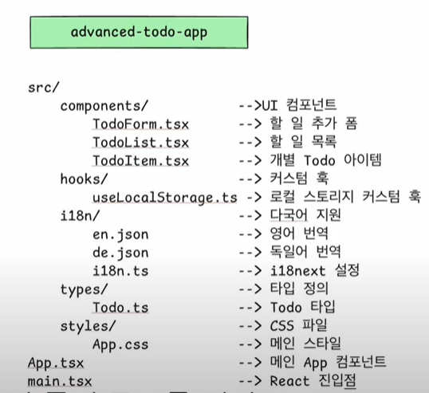

# 입실 체크 해주세요 !! 🍳

# Spring boot Project Setting
https://start.spring.io/
에서 필요 의존성들을 추가했습니다(openAPI는 mvn을 통한 추가)
- build.gradle 확인하면 됩니다.

이전과의 차이점이라면 지난번에는 backend를 먼저 만들고 front를 작성했었습니다.

근데 지금은 프론트가 있는 상황이기 때문에 페이지를 가지고 미리 application.properties를 일부 작성할 수 있다는 점도 고려할 수 있습니다.

DB 연결도 마찬가지입니다.

이제 고민해야할 부분은
DB에 뭐가 들어가야하는지.
가 되겠습니다.

엔티티 클래스를 작성
Todo -> column들을 정해야할건데 저희가 작성한 프론트를 기준으로 어떤 컬럼 즉, Java 엔티티 클래스를 기준으로는 어떤 필드가 들어가야할까요?

domain 패키지를 만들어서 entity 클래스 작성
id / text / completed에 해당하는 Todo 클래스를 작성하시오.

mvn에서 spring data rest를 검색 후 build.gradle에 의존성을 추가하겠습니다.

Entity class 완성 -> Repository 작성

http://localhost:8080/swagger-ui.html
에서 현재 생성된 API들을 확인할 수 있습니다.
근데 직접적으로 저희가 코드를 짠게 없죠

이유 : CrudRepository에서 딸려있는 메서드들을 이용하여
Spring data REST로 자동생성이 됐고

그걸 문서화 시킨 것이 OpenAPI

MariaDB 상에서 테이블이 생성됐다는 것을 확인할 수 있고,
Spring Data Rest를 통해서
CRUD를 할 수 있다는 것이 그리고, 그 엔드포인트가 어떻게 되는지도 체크 -> postman을 쓸 수 있다

spring security 관련 의존성을 주석처리
코끼리 클릭
애플리케이션 재실행
postman 확인 POST / GET

POST 요청을 통해서
text: "React 로그인 컴포넌트 생성"
completed: true
할 것

PUT요청을 통해서 -> 전체 속성을 다 바꿔줘야한다
1번 아이디에 해당하는 todo를 true로 바꿀 것

- 즉 PUT 요청의 경우에는 /api/todos/{id} 형태로 DB의 아이디를 명시해야한다는 점
- 내부에 바꾸고자 하는 부분 말고 다른 속성들도 전부 다 작성해줘야 합니다.
```json
{
    "text": "새로운 ID 생성 테스트",
    "completed": true
}
```

PATCH요청을 통해서 -> 바꾸고자하는 것만 처리하면 된다
2번 아이디에 해당하는 todo를 false로 바꿀 것

- PATCH 요청의 경우에는 /api/todos/{id} 형태로 DB의 아이디를 명시해야한다는 점
- 바꾸고자 하는 부분의 속성만 명시하면 된다는 점이 PUT과 다릅니다
```json
{
    "completed": false
}
```

GET요청을 통해서 전체 todos를 가지고 올 것

혹시 시간 좀 남으시는데 복습 뭐할지 모르시겠으면
Spring Data REST 안썼을 때 코드 어떻게 작성하는지 검색 좀 해보세요

useState [ text, setText ] = useState('');
useEffect(callback함수, [])

금일 수업 사항

어제 만든 프론트 기준으로 
Entity -> Repository -> spring data REST 적용 -> DB 연결(application.properties 사항 작성)
-> Heidi에서 연결되어있는지 체크 -> OpenAPI를 통해서 Swagger API문서 확인 -> api들을 이용하여 postman에서 HTTP 메서드 적용되는지 체크

이제 남은 거

프론트 수정해서 localStorage로 되어있는 부분 전부 다 DB랑 연결시키도록 수정

Login 컴포넌트 생성 - 프론트
Spring Security 적용 - 백

또 연결

CSS 꾸미기

심심하신 분들 Login Component 생성
Blog Spring Boot Project 통째로 생성 <-> React 프로젝트로 페이지 생성 등
아니면 자습
근데 자면 상황봐서 좀 깨우겠습니다...

https://velog.io/@kth1007/Oauth2.0-%EA%B8%B0%EB%8A%A5-%EC%B6%94%EA%B0%80
